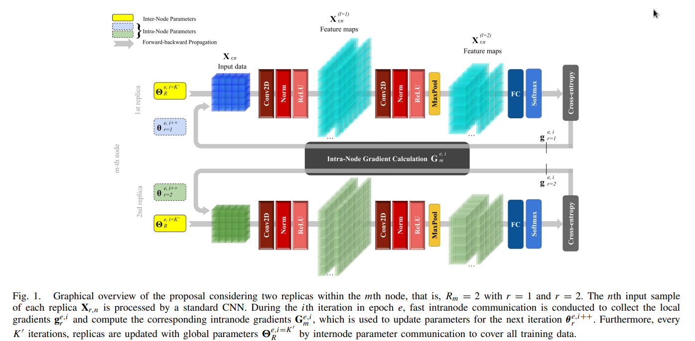

# Enhancing Distributed Neural Network Training through Node-Based Communications
The Code for "Enhancing Distributed Neural Network Training through Node-Based Communications". [https://ieeexplore.ieee.org/document/10254237]
```
S. Moreno-Álvarez, M. E. Paoletti, G. Cavallaro and J. M. Haut.
Enhancing Distributed Neural Network Training through Node-Based Communications.
IEEE Transactions on Neural Networks and Learning Systems.
DOI: 10.1109/TNNLS.2023.3309735,
September 2023.
```




## Codes used in the paper
```
Optimizers: https://github.com/jettify/pytorch-optimizer
Cifar models: https://github.com/kuangliu/pytorch-cifar
Imagenet-1K models: https://github.com/pytorch/vision/tree/release/0.10
FineGrained models: https://github.com/pytorch/vision/tree/release/0.10
Vision Transformer: https://github.com/lukemelas/PyTorch-Pretrained-ViT
Generative Adversarial Networks: https://github.com/eriklindernoren/PyTorch-GAN
Recurrent Neural Network: https://github.com/pytorch/examples/blob/main/mnist_rnn
```
